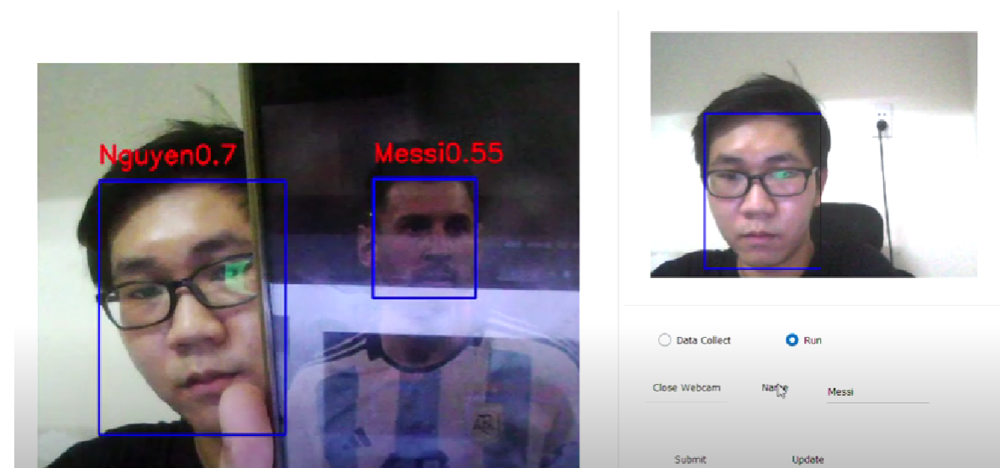

# Face_Recognition
* Use MTCNN for face detection
* Use [MagFace+UNPG](https://github.com/jung-jun-uk/unpg) for face recognition
* PyQt5 GUI
## Demo (Click to watch)

# File ONNX Model
[Link Download](https://drive.google.com/drive/folders/1pd3QNagID5KeHwOLr3C_LUB1Sc2CNsln?usp=sharing)

